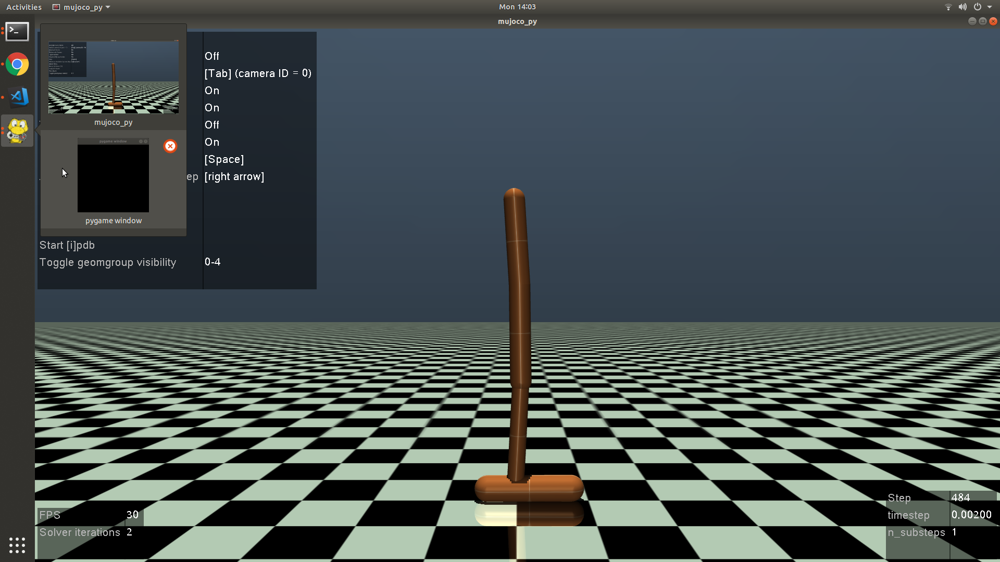

# Quantilizers

[How useful is quantilization for mitigating specification-gaming?](https://drive.google.com/uc?export=download&id=13qAfOm8McRvXS33MCNH0ia4ApMIClZP9) introduces variants of several classic environments (Mountain Car, Hopper and Video Pinball) where the observed reward differs from the true reward, creating an opportunity for the agent to game the specification of the observed reward. The paper shows that a quantilizing agent avoids specification gaming and performs better in terms of true reward than both imitation learning and a regular RL agent on all the environments. This repository contains the code to reproduce the experiments from the paper.

# Getting Started

Clone this repository and install the other dependencies with `pip`:

```
git clone https://github.com/mtrazzi/quantilizers.git
cd quantilizers
pip install -U -r requirements.txt
```

For Hopper-v2, you'll need to install [mujoco](https://github.com/openai/mujoco-py) first.

# Play as a human

```bash
python play/gather_data.py --env_id {'Hopper-v2','MountainCar-v0'}
```

(Currently doesn't support Video Pinball. If you want to play 'VideoPinballNoFrameskip-v4' you should adapt the keys to action dictionary from ```play/gather_data.py``` to the actions of VideoPinball.)

## Instruction for Hopper-v2

0) **The goal of this game is to go as far as you can on the right**, using three rotations: the first one is next to the foot, the middle one and a higher one.

1) After launching ```python gather_data.py```, you should see some mujocopy rendering (see image below).

2) Press `d` to have "render every frame" set to `Off`, and press `Tab` to have an horizontal camera angle that follows you.

2) After step 1), you will now start playing the game using your keyboard. To allow PyGame to listen to your keyboard movements, **you must have the focus on the pygame black window** (i.e. the black window must be in front of any rendering from the environment).



3) When the pygame black window is in front, the keys to move are {j,k} (for the foot), {w,s} for the top junction and {a,d} for the middle junction. Those keys can be directly modified in the [`gather_data.py`](https://github.com/mtrazzi/quantilizers/blob/master/gather_data.py) file, replacing {j,k,w,s,a,d} with your keys.

4) To do a few steps, you can mostly use the keys for the foot (jk) and sometimes use the keys from the upper junction (sw). It's recommended to watch a video of a trained AI performing the Hopper-v2 task [here](https://www.youtube.com/watch?v=2lf-3tgWiUc&t=0m45s) before playing.

5) When you're done, you can close the window using the [Esc] key.

## Instruction for MountainCar-v0

1) after launching ```python gather_data.py``` you should **put the focus on the pygame black window***. That's really important. Otherwise it's impossible to catch the moves you're doing.

2) moves are {a,s,d} where a is left and d is right. The goal is to reach the flag on the right.

# Datasets

To import the `Hopper-v2` and `MountainCar-v0` human datasets, run the following command:
```
cd scripts/
sh load_data.sh
cd ..
```

The downloaded datasets will be in `log/[ENV_NAME]/[DATASET_NAME].npz`.

For the Atari Grand Challenge datasets (for Video Pinball), the `v2` datasets can be found [here](https://drive.google.com/drive/folders/1lkH15mXh8r3CEE2Onxd6ZMCASj3tfFPX?usp=sharing).

# Launching the train/test/plot pipeline

Simply run the following command:
```
python quantilizer.py [-h] [--dataset_name DATASET_NAME] [--env_name ENV_NAME]
                      [--do DO [DO ...]] [--seed_min SEED_MIN]
                      [--seed_nb SEED_NB]
                      [--number_trajectories NUMBER_TRAJECTORIES]
                      [--quantiles QUANTILES [QUANTILES ...]]
                      [--render RENDER] [--plotstyle PLOTSTYLE] [--path PATH]
```

where 
- `DATASET_NAME` corresponds to the name of the `.npz` file (for instance "ryan").
- `ENV_NAME` is the name of the gym environment (for instance `Hopper-v2`).
- `DO` is the list of things you want to do for this particular setup (for instance "train" if you just want to train your quantilizer model, or "train test plot" if you want to train the model, generate some rollouts and plot those).
- The trainings, testing, plotting etc. are done for seeds {`SEED_MIN`, `SEED_MIN + 1`, ... , `SEED_MIN + SEED_NB - 1`}.
- `NUMBER_TRAJECTORIES` is the number of episodes generated in rollouts.
- the arguments after `--quantiles` is the list of quantiles you want to do the training, testing, etc. on. For instance `1.0 0.5 0.1`.
- `RENDER` is True or False, and defines whether the `render` method from gym is applied when generating rollouts.
- `PLOTSTYLE` can be `mean_seeds`, `median_seeds` or `distribution`, defining how to aggregate the results from different seeds.
- `PATH` is to save your model in a specific path, for instance can be `run_nb_42/`

Here is a simple example that will generate true & proxy rewards in `log/fig`:
`python quantilizer.py --do train test plot --env_name MountainCar-v0 --quantiles 1.0 0.5 0.25 0.1 0.01 --plotstyle mean_seeds`
